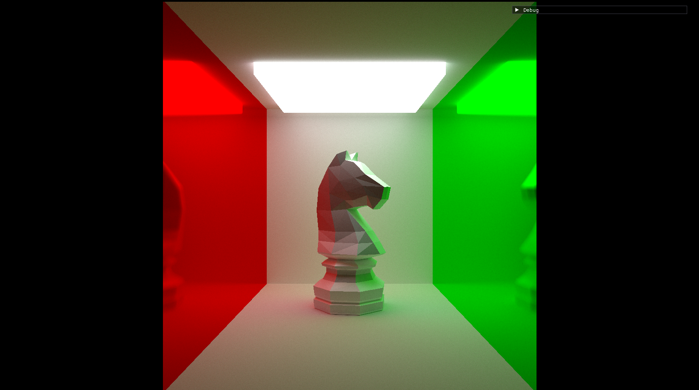

# RayTracer
A fairly small and simple ray tracer, written in GLSL compute shaders. I mostly followed
Sebastian Lague's [Ray Tracing](https://www.youtube.com/watch?v=Qz0KTGYJtUk) series
while rewriting code into compute shaders and independently 
designing CPU side code.

## Build
The project uses CMake and there are no platform-specific 
binaries linked, so the building process should be 
straightforward on all platforms. Use the following command to generate
project with g++ and ninja.
``` bash 
cmake -S . -B CMakeBuild -DCMAKE_BUILD_TYPE=Debug -G "Ninja" -DCMAKE_CXX_COMPILER=C:/MinGW/mingw64/bin/g++.exe
```
CMAKE_BUILD_TYPE supports "Debug" and "Release" builds.
Use the next command to build the project.
```bash
ninja -C CMakeBuild
```

## Features
- Simple path tracing with variable number of ray reflections and rays per pixel
- Specular reflections and variable object smoothness
- .obj mesh loading
- Russian roulette probabilistic termination
- Progressive rendering
- An extremely simple GLSL preprocessor that supports handling #include directives
- Little GUI menu to show FPS and tweak some parameters

## Showcase




## License
[MIT](https://choosealicense.com/licenses/mit/)
